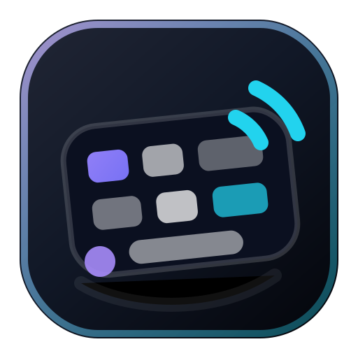

# KeySense

<p align="center">
  
</p>

KeySense is an interactive keyboard gallery for exploring how popular keyboards look, feel, compare, and sound. You can browse curated boards, press keys on model-specific layouts, compare two keyboards side by side, and run a typing test with switch-style sound feedback.

Live site: [https://key-sense.netlify.app/](https://key-sense.netlify.app/)

## Features

- Interactive keyboard stage with physical key presses and clickable keys.
- Per-model visuals for Apple, Logitech, and Keychron keyboards.
- Switch sound profiles for linear, tactile, and clicky-style feedback.
- Keyboard comparison page with side-by-side specs and sound playback.
- Typing test with WPM, accuracy, elapsed time, and live keyboard audio.
- Responsive dark UI built around compact product-focused workflows.
- Custom KeySense favicon, app icons, and installable web app manifest.

## Tech Stack

- Next.js 16 App Router
- React 19
- TypeScript
- Tailwind CSS 4
- Framer Motion
- Three.js and React Three Fiber for richer model experiments
- Native Web Audio for keyboard sound playback

## Requirements

- Node.js 20.9.0 or newer
- npm

The project includes an `.nvmrc` so `nvm use` selects the expected Node version.

## Getting Started

```bash
npm install
npm run dev
```

Open [http://localhost:3000](http://localhost:3000) to use the app.

## Scripts

```bash
npm run dev     # Start the local Next.js development server
npm run build   # Create a production build
npm run start   # Run the production build
npm run lint    # Run ESLint
```

## App Routes

- `/` - Browse the keyboard catalog and try the featured keyboard.
- `/keyboard/[id]` - Inspect one keyboard, change sound profiles, and view specs.
- `/compare` - Compare two keyboards visually and by specs.
- `/typing-test` - Measure WPM and accuracy while hearing the selected keyboard.

## Current Keyboard Catalog

- Apple Magic Keyboard
- Apple MacBook Pro 16" Keyboard
- Logitech MX Keys
- Logitech G915 TKL
- Logitech MX Mechanical
- Logitech K380
- Keychron Q1 Pro
- Keychron K2

## Project Structure

```text
app/                     Next.js routes, layout, favicon, app icons, manifest
components/providers/    App shell, sound provider, and shared providers
components/ui/           Header, logo, cards, filters, and controls
data/keyboards.ts        Keyboard metadata used by lists, filters, and specs
hooks/                   Key press, typing test, and sound engine hooks
keyboards/               Model-specific layouts, renderers, and visual profiles
lib/types.ts             Shared TypeScript domain types
public/                  Images, generated app icons, logo source, and sounds
```

## Adding A Keyboard

1. Add the keyboard metadata in `data/keyboards.ts`.
2. Create or reuse a visual model in `keyboards/<brand>/`.
3. Register the model in `keyboards/_base/registry.ts`.
4. Add sound files under `public/sounds/<keyboard-id>/` if the keyboard needs custom audio.
5. Add product imagery or generated assets under `public/keyboards/` when a card/detail view needs it.
6. Test `/`, `/keyboard/<id>`, `/compare`, and `/typing-test` after registering the model.

## Assets And Icons

- `public/keysense-mark.svg` is the editable source logo mark.
- `app/favicon.ico`, `app/icon.png`, and `app/apple-icon.png` are the browser/app icon assets recognized by Next.js App Router metadata conventions.
- `public/icon-192.png` and `public/icon-512.png` are referenced by `app/manifest.ts`.

Regenerate icon PNG/ICO files from `public/keysense-mark.svg` after changing the mark.

## Development Notes

- This project uses Next.js 16. Before changing framework APIs, metadata conventions, or routing behavior, read the relevant local docs in `node_modules/next/dist/docs/`.
- Browser audio may require a user gesture before sound playback starts.
- No environment variables are required right now. If new secrets are introduced, document them in an `.env.example` file and keep real `.env*` files out of git.

## Deployment

Build with `npm run build`, then deploy to any platform that supports Next.js. Vercel is the easiest default option for an App Router project.
